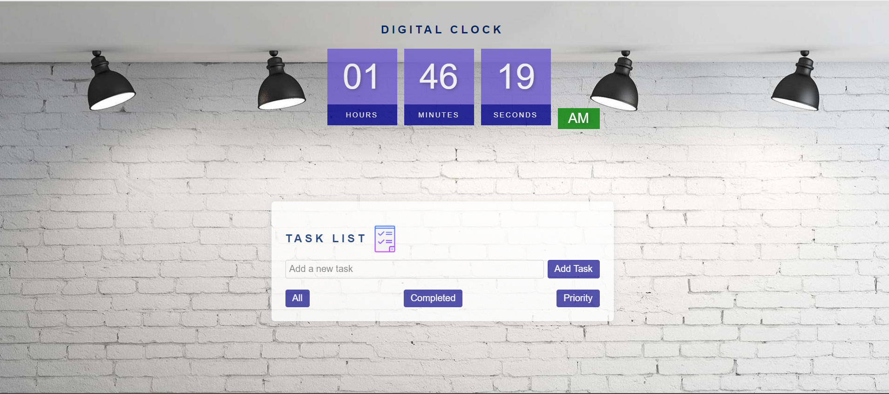

# MOD1-Project

**Task List Web Application**

## Overview

This web application is a simple task list manager that allows users to add, complete, prioritize, and filter tasks. It provides an easy way to organize and manage your tasks online. It also includes a real-time clock display.

## Features

- **Add Task**: Enter a task in the input field and click "Add Task" to add it to the task list.
- **Complete Task**: Click the "Complete" button next to a task to mark it as completed. Completed tasks are displayed with a strikethrough.
- **Delete Task**: Click the "Delete" button next to a task to remove it from the list.
- **Priority Task**: Click the "Priority" button to mark a task as a priority. Prioritized tasks are displayed in red.
- **Filter Tasks**: Use the "All," "Completed," and "Priority" buttons to filter tasks based on their status.

## Getting Started

1. Clone this repository to your local machine:

git clone https://github.com/LanaSvet11/MOD1-Project.git 2. Open the index.html file in your web browser to launch the application.

## Usage

**Adding a Task:**
Enter the task description in the input field.
Click the "Add Task" button.
**Completing a Task:**
Click the "Complete" button next to the task you want to mark as completed.
**Deleting a Task:**
Click the "Delete" button next to the task you want to remove from the list.
**Prioritizing a Task:**
Click the "Priority" button next to the task to mark it as a priority.
**Filtering Tasks:**
Use the "All," "Completed," and "Priority" buttons to filter tasks based on their status.

## Contributing

Contributions are welcome! If you find any issues or have suggestions for improvements, please open an issue or create a pull request.

## License

This project is licensed under the MIT License. See the [LICENSE file](./MIT%20License.txt) for details.

## Contact

If you have any questions or suggestions, please feel free to contact us:

Email: sv.golovatenko@gmail.com
LinkedIn: https://www.linkedin.com/in/svitlana-holovatenko/
